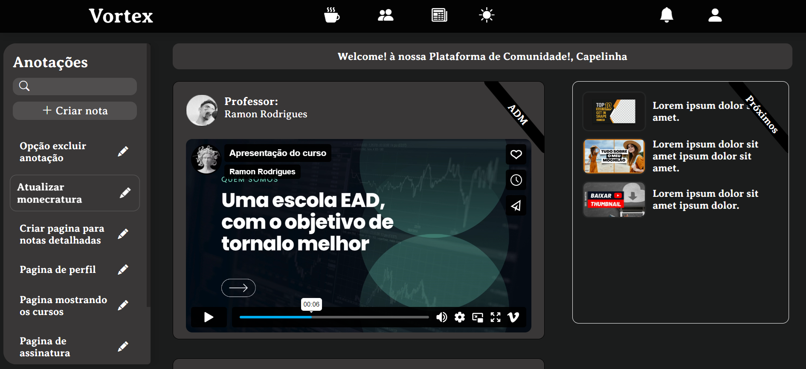

# **🎓 Plataforma EAD (Vortex)**

  

## Demonstração



## **📚 Visão Geral**

**Vortex** é uma plataforma de edcação a distancia. Nosso objetivo é criar uma escola de programação. Este projeto oferece cursos feitos por professores diplomados com otima didatica.

## **🚀 Funcionalidades**

- **🔐 Otima qualidade de video**
- **🌍 Sistema de anotação**
- **📊 Painel de controle intuitivo**
- **⚡ Alta performance**

## **🛠️ Tecnologias Utilizadas**

Este projeto foi desenvolvido utilizando as seguintes tecnologias:

- **Frontend**: 
- **Backend**: 
- **Banco de Dados**: 
- **Controle de Versão**: 

## **📦 Instalação**

Siga os passos abaixo para configurar o ambiente de desenvolvimento local:

```bash
# Clone este repositório
$ git clone https://github.com/seu-usuario/nome-do-projeto.git

# Acesse a pasta do projeto no terminal
$ cd nome-do-projeto

# Instale as dependências
$ npm install

# Inicie o servidor
$ npm start
````

# **Precisamos de você para seguir em frente sinta a vontade para explorar o codigo e contribuir com ideias e inovações**
**Procuramos tambem professores dispostos a entrar nesta jornada**
